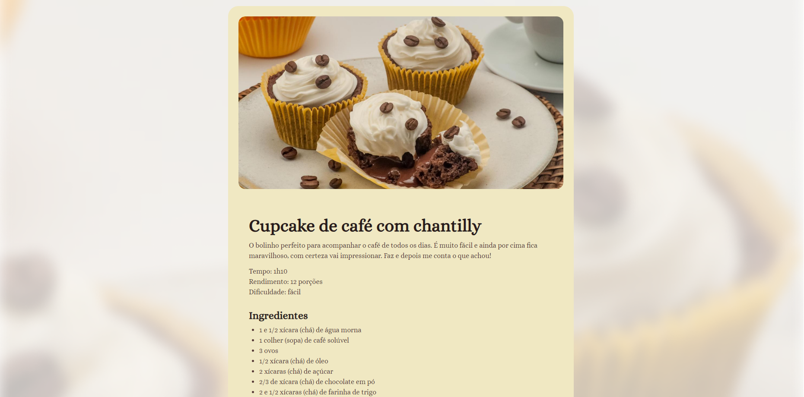

## Exercicio do Curso Fullstack Rocketseat
- Fazer uma page de uma receita de Cupcakes

## Tecnologias
- HTML
- CSS
- vscode

## 🧩 Como Usar
- Acesse a página atráves do link: https://cupcake-chantily.vercel.app

## 🤝 Contribuições
Contribuições são bem-vindas! Se você quiser melhorar a landing page ou adicionar novas funcionalidades, sinta-se à vontade para abrir um Pull Request.

## 📧 Contato
Para quaisquer dúvidas ou sugestões, você pode me contatar através do e-mail: matheusibnf@hotmail.com

 
  

